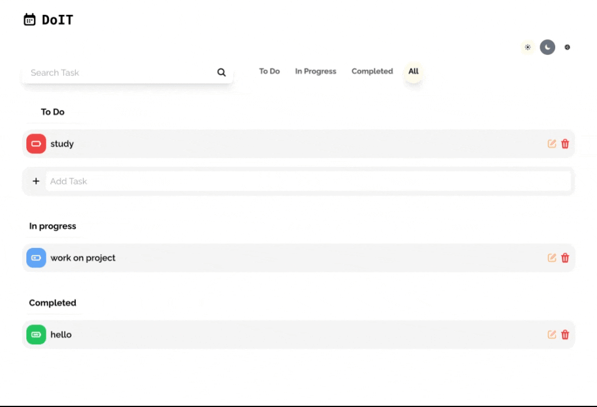

# Todo App

A simple and customizable Todo application to help you manage your tasks efficiently.

## Features

- Add, edit, and delete tasks.
- Assign tags to tasks for better categorization.
- Mark tasks as completed or pending.
- Filter tasks by status.
- Responsive design for mobile and desktop.

## A lil showcase

## Usage
- Add a Task: Type a task in the input field and click the "Add" button or press Enter.
- Search Task: Search for task using search bar.
- Edit Task modal: Open modal for editing task, creat new tag, and assign tag.
- Assign Tags: Click the tag icon to assign a category or purpose to the task.
- Categorization: Tasks are displayed in rows based on their status.
- Dark mode: Have option to change to dark theme.
  
## Technologies Used
- Frontend: React, TailwindCSS
- State Management: Zustand
- Icons: Heroicons

## Contact
For any questions or suggestions, feel free to reach out:
- GitHub: hanluu1.
- Email: hanluu062019@gmail.com.

